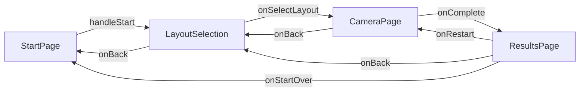

# Vintage Photobooth — Design Document

**Date:** February 24, 2026 | **Version:** 1.1 (updated from Feb 23 draft)

---

## 1. Overview

| | |
|---|---|
| **Purpose** | Describe the app structure, page flow, components, state/data model, styling, assets, and known improvement areas |
| **Tech Stack** | React 18 + TypeScript, Vite, Tailwind-style utility classes, `motion/react` for animations, `html2canvas` for export |
| **Figma Origin** | [Vintage Photobooth Webpage (Figma)](https://www.figma.com/design/QlhJPmU22uJExkzdXyYtPV/Vintage-Photobooth-Webpage) |

---

## 2. Entry & Boot

```
index.html
  └─ src/main.tsx       ← ReactDOM.createRoot → <App />
       └─ src/App.tsx   ← Root: manages navigation state & page transitions
```

- `main.tsx` mounts `<App />` into `#root`.
- `App` is the single source of truth for page-level state (see §5).

---

## 3. Page Flow



All transitions use an 800ms `animate-flip` CSS animation controlled by the `isFlipping` boolean in `App`.

---

## 4. Pages

### 4.1 StartPage — [`src/components/StartPage.tsx`](src/components/StartPage.tsx)
- Landing screen with vintage background, logo/title, and a single `START` CTA.
- Calls `onStart()` → triggers flip animation → navigates to `LayoutSelection`.

### 4.2 LayoutSelection — [`src/components/LayoutSelection.tsx`](src/components/LayoutSelection.tsx)
- Displays three layout cards side-by-side on desktop (`grid-cols-3`), stacked on mobile (`grid-cols-1`).
- Each card shows a visual preview of the strip (pose slots rendered as dashed boxes).

| Layout | Label | Poses | Strip Size |
|---|---|---|---|
| A | Classic Strip | 3 | 6×2" |
| B | Quad Strip | 4 | 6×2" |
| C | Duo Strip | 2 | 6×2" |

- Back button (top-left) returns to `StartPage`.
- Calls `onSelectLayout(layout: LayoutType)` → navigates to `CameraPage`.

### 4.3 CameraPage — [`src/components/CameraPage.tsx`](src/components/CameraPage.tsx)
- Handles `navigator.mediaDevices.getUserMedia` with graceful fallback to file upload on permission denial.
- Renders camera preview, optional CSS photo filters, countdown timer, and a capture button.
- Emits `CapturedImage[]` (array of `{ url: string; filter: string }`) to `App` via `onComplete`.
- Back button returns to `LayoutSelection`; back clears `capturedImages`.

### 4.4 ResultsPage — [`src/components/ResultsPage.tsx`](src/components/ResultsPage.tsx)
- **Photo strip:** Fixed 320×960px white-bordered strip displaying captured images stacked vertically; images are horizontally mirrored (`scaleX(-1)`) for a natural look.
- **Sticker sidebar (desktop):** Sticky right column (280px) showing 5 sticker thumbnails in a 2-col grid.
- **Sticker panel (mobile):** Shown below the strip as a collapsible section (3-col grid).
- **Notes panel:** Custom note input (max 50 chars) + 5-font cursive picker + "Place Note on Strip" button; live font preview shown below input.
- **Export:** `handleSave` lazy-imports `html2canvas`, renders `Strip + decorations` at `scale: 2`, produces a PNG blob, auto-downloads as `photobooth-strip-<timestamp>.png`.
- **Print:** `handlePrint` calls `window.print()`; `@media print` styles hide all non-strip content.
- **Navigation:** Back → `LayoutSelection`. Restart → `CameraPage`. Start Over → `StartPage` (Home icon).

---

## 5. Core Components

### 5.1 DraggableSticker — [`src/components/DraggableSticker.tsx`](src/components/DraggableSticker.tsx)
- Props: `id`, `src`, `x`, `y`, `scale`, `onUpdatePosition`, `onUpdateScale`, `onDelete`.
- Pointer events for mouse/touch drag.
- Pinch-to-zoom gesture support (two-finger touch).
- Zoom-in / zoom-out buttons (+/−) for non-touch precision.
- Delete (×) button.
- `motion` spring animation on scale changes.

### 5.2 DraggableNote — [`src/components/DraggableNote.tsx`](src/components/DraggableNote.tsx)
- Props: `id`, `text`, `font`, `x`, `y`, `scale`, `onUpdatePosition`, `onUpdateScale`, `onDelete`.
- Same drag / pinch-to-zoom / zoom buttons / delete pattern as `DraggableSticker`.
- Renders note text in the selected cursive `font` via `fontFamily` inline style.

### 5.3 ImageWithFallback — [`src/components/figma/ImageWithFallback.tsx`](src/components/figma/ImageWithFallback.tsx)
- Renders `` with an error-state fallback placeholder for resilient Figma asset loading.

---

## 6. State & Data Flow

All state lives in `App.tsx`:

| State | Type | Purpose |
|---|---|---|
| `currentPage` | `'start' \| 'layout' \| 'camera' \| 'results'` | Controls which page renders |
| `selectedLayout` | `LayoutType ('A' \| 'B' \| 'C' \| null)` | Passed to `CameraPage` (capture count) and `ResultsPage` (strip grid) |
| `capturedImages` | `CapturedImage[] ({ url, filter })` | Array of base64 data-URL images with applied filter name |
| `currentFilter` | `string` | Active camera filter (e.g., `'none'`, `'sepia'`) |
| `isFlipping` | `boolean` | Triggers 800ms CSS flip animation between pages |

**Flow:** user picks layout → camera captures N images → `capturedImages` set → `ResultsPage` renders strip with decorations → user exports.

---

## 7. Styling, Fonts & Animations

| Area | Details |
|---|---|
| **Global styles** | [`src/styles/globals.css`](src/styles/globals.css) — CSS variables, vintage theme tokens, `@keyframes float / grain / flip` |
| **Component styles** | [`src/index.css`](src/index.css) — Tailwind-compatible utility classes |
| **Color palette** | Background `#f5e6d3` (warm cream), Accent `#8b4513` (saddle brown), Muted `#a0826d` |
| **Body font** | Serif (`font-serif`) throughout UI |
| **Note fonts** | Pacifico, Tangerine, Great Vibes, Parisienne, Dancing Script (Google Fonts, imported in `globals.css`) |
| **Texture** | SVG fractal noise data-URL overlay at 5% opacity for vintage grain effect |
| **Page transition** | `animate-flip` class (CSS `@keyframes`, 700ms, toggles via `isFlipping`) |

---

## 8. Assets & Icons

| Type | Details |
|---|---|
| **Sticker assets** | 5 PNGs imported as `figma:asset/<sha>.png` (resolved by Vite plugin at build time) |
| **Icons** | `lucide-react` — `Download`, `Printer`, `RotateCcw`, `Home`, `ArrowLeft`, `StickyNote` |

---

## 9. Key Dependencies

| Package | Role |
|---|---|
| `html2canvas` | Flatten DOM (strip + stickers + notes) to canvas for PNG export |
| `motion` / `motion/react` | Spring-scale animation on draggable stickers |
| `lucide-react` | Icon set |
| `vite` | Build tool; resolves `figma:asset/` imports |

---

## 10. Build & Run

```bash
npm install
npm run dev      # Vite dev server (HMR)
npm run build    # Production bundle
```

Vite config: [`vite.config.ts`](vite.config.ts)

---

## 11. Accessibility & Permissions

- ARIA labels present on: back buttons (`aria-label="Back to home"`, `"Back to layout selection"`), sticker add buttons (via `title`).
- Camera permission flow surfaces step-by-step guidance and graceful fallback in `CameraPage`.
- **TODO:** Add ARIA roles/labels to draggable canvases; add keyboard move/scale shortcuts for stickers and notes.

---

## 12. Observations & Recommendations

| Area | Observation | Recommendation |
|---|---|---|
| **Routing** | Conditional rendering via `currentPage` state; no URL-based routing | Add hash routing (e.g., React Router) for shareable URLs and browser back-button support |
| **Persistence** | No autosave; refresh loses all work | Add `localStorage` autosave with a versioned JSON schema |
| **Export quality** | `html2canvas` at 2× scale; CORS assets must be tested in prod build | Verify all sticker/font assets are CORS-safe; consider puppeteer server-side for high-fidelity print |
| **Memory** | Captured images stored as base64 strings in React state | For long sessions, move blobs to `IndexedDB` to reduce JS heap pressure |
| **Testing** | No automated tests currently | Add unit tests for capture-count-per-layout logic and export helpers; add Playwright E2E |
| **Performance** | `html2canvas` lazy-loaded ✅; sticker assets pre-bundled | Lazy-load sticker images on demand for faster initial paint |

---

## 13. Files of Interest

| File | Role |
|---|---|
| [`src/App.tsx`](src/App.tsx) | Root component, global state, page routing |
| [`src/components/StartPage.tsx`](src/components/StartPage.tsx) | Landing page |
| [`src/components/LayoutSelection.tsx`](src/components/LayoutSelection.tsx) | Layout picker (A/B/C) |
| [`src/components/CameraPage.tsx`](src/components/CameraPage.tsx) | Camera capture & upload |
| [`src/components/ResultsPage.tsx`](src/components/ResultsPage.tsx) | Strip, stickers, notes, export, print |
| [`src/components/DraggableSticker.tsx`](src/components/DraggableSticker.tsx) | Draggable + scalable sticker |
| [`src/components/DraggableNote.tsx`](src/components/DraggableNote.tsx) | Draggable + scalable text note |
| [`src/styles/globals.css`](src/styles/globals.css) | Global CSS, animations, fonts |
| [`src/index.css`](src/index.css) | Utility/component styles |
| [`src/main.tsx`](src/main.tsx) | App entry point |
| [`vite.config.ts`](vite.config.ts) | Build config (Figma asset plugin) |

---

*Generated from repository code scan on February 24, 2026.*
